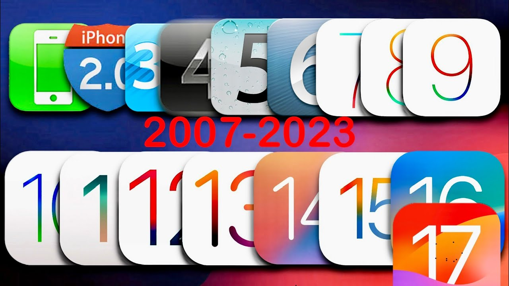
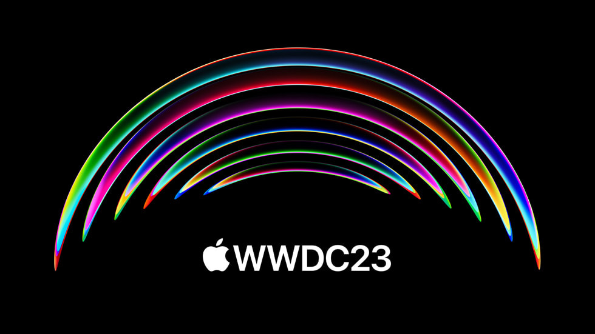
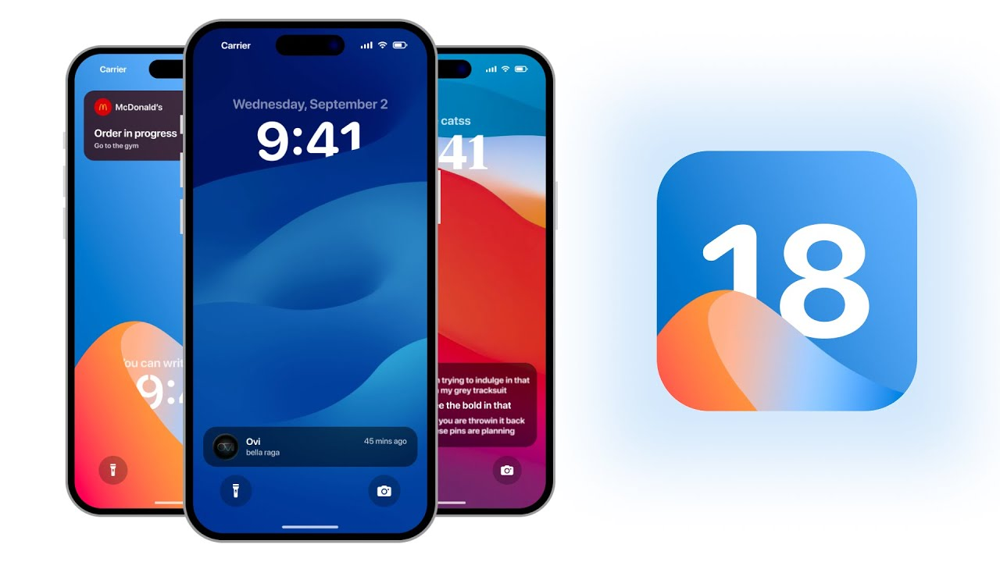

# Veille Technologique : Les dernières tendances, évolutions et prévisions du système d’exploitation mobile iOS™ ~ Mouaz MOHAMED
Voici brièvement ma veille technologique pour l'épreuve E4 du BTS SIO session 2024. 

---

## Présentation d'iOS
iOS (anciennement iPhone OS) est un système d'exploitation mobile développé par Apple depuis la sortie du premier iPhone 2G en Juin 2007 jusqu'à aujourd'hui avec les iPhone 15 et 15 Pro. 
La première version d'iOS est iPhone OS 1 sortie en Juin 2007 et la dernière version est iOS 17 sortie en Septembre 2023.
iPhone OS a été renommé par iOS le 7 juin 2010.  

---

## Veille technologique
  
Le 5 juin 2023, lors de la WWDC23 (WorldWide Developer Conference) d'Apple, ils ont annoncé le programme Bêta d'iOS 17 pour les développeurs. Etant très passionné de la marque à la pomme depuis tout petit, j'ai été extrêmement curieux de tester et de suivre l'évolution des nouveautés de la nouvelle version d'iOS. Par la suite, sur le site de 01net.com, j'ai vu que la mise à jour de la version Bêta pour les développeurs était gratuites avec un compte Apple pour les particuliers, car avant cela, il fallait avoir un compte Apple Developer et payer une licence afin d'accéder aux version Bêta des systèmes d'exploitation d'Apple. Donc, j'ai installé la version Bêta d'iOS 17 pour les développeurs gratuitement sur mon iPhone en respectant les démarches nécessaires pour l'installation et en prenant les conséquences liées à cette version Bêta (Bugs, chute drastique de l'autonomie, surchauffes, crashs, ...).

Dès que je l'ai installé, j'ai commencé à découvrir toutes les nouveautés et à tester ces dernières mais, les problèmes faisait leurs apparition : 

- Mon iPhone faisait que de chauffer même sans utilisation de ce dernier
- L'autonomie chutait drastiquement même sans utilisation du téléphone
- L'iPhone ne faisait que d'avoir des bugs

Au fil des semaines, j'ai constaté que ces problèmes diminuait de plus en plus grâce aux nouvelles mises à jour Bêta pour les développeurs qui se font tous les mardis ou tous les deux mardis et ce jusqu'à même aujourd'hui, en rajoutant des nouveautés, des améliorations et des correctifs.

Chaque semaine, je consultais des sites comme MAC4EVER, YouTube ou encore Frandroid afin de voir la date de sortie des nouvelles versions Bêta d'iOS 17 et de se renseigner sur les nouveautés, les améliorations et les correctifs de chaque version et ce jusqu'à même aujourd'hui.  

Il y a beaucoup de prévisions sur la prochaine version d'iOS qui sera iOS 18 comme le Background Image dans iMessage, Split View, Ferret (l'IA Open Source d’Apple) ou encore la compatibilité de cette mise à jour depuis l'iPhone 11.

---

## Articles et sites consultés

 
Vous pouvez consulter mon site Notion contenant les sites et articles principaux que j'ai consultés et qui m'ont servis principalement pour ma veille technologique : [Veille Technologique - Mouaz MOHAMED](https://www.bit.ly/mouaz-ios "Consulter ma veille technologique")